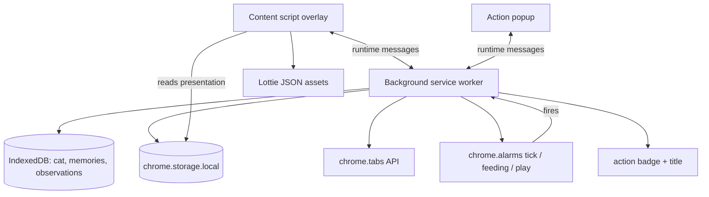

# Architecture

This document explains how **Tabby** works internally.

## Design goals

1. **Least privilege:** `tabs`, `storage`, `alarms`, and `scripting` only. No `history`, no broad `host_permissions`.
2. **Privacy:** classify from **active tab title + URL** only. Never read page body text. No network calls at runtime.
3. **Local-only:** cat state, memories, and observations live in **IndexedDB** on the device. Settings and overlay cache use **`chrome.storage.local`**.
4. **Gentle companion:** mood nudges require dwell time and visit dedup. Unprompted speech respects quiet hours, daily caps, and cooldowns.
5. **One cat, one tab:** at most one content-script overlay is active at a time on the focused tab.

## Product choices

| Idea | Implementation choice |
|------|----------------------|
| Tamagotchi-style grinding | Small +1/-1 mood bumps per page visit, not XP bars |
| Real-time page scraping | Title + URL heuristics only (`site-registry`, keywords, YouTube path rules) |
| Cloud AI personality | Curated template speech (`speech-fallback`) keyed by mood and life stage |
| Always-on mascot | Global visibility with per-page hide, do not disturb, and ambient peek windows |
| Sprite sheets | Bundled **Lottie** JSON per life stage, played with dotLottie Web |
| Growth from browsing | Life stage advances by **calendar days** since adoption, not tab count |

## Components



### Content script (`entrypoints/content/`)

Manifest-registered on `<all_urls>` (excluding some sensitive sites in `overlay-excluded-hosts/`). Renders the floating cat UI on the **single active overlay tab**.

Responsibilities:

1. **Overlay chrome:** draggable cat, speech bubble, care menu, intro tour.
2. **Lottie playback:** mood and care-action animations from `public/animations/{stage}/`.
3. **Presentation sync:** reads cached `CatPresentation` from storage and listens for `overlayActivate` / `overlayDeactivate` messages.
4. **Care actions:** forwards pet, feed, play, ask, dismiss, and do-not-disturb choices to the background worker.

Top-level iframes are skipped. Duplicate roots are guarded with a per-window singleton.

### Background service worker (`entrypoints/background.ts`)

Manifest V3 event-driven worker. Serializes work through an internal task queue.

Responsibilities:

1. **Tab focus tracking:** maintain `ActiveTabSnapshot` (tab id, title, URL, focus start).
2. **Dwell scoring:** after ≥ 1 minute on a trackable page, call `recordPageVisit` once per focus.
3. **Minute tick:** `chrome.alarms` every minute for passive vital drift and toolbar badge refresh.
4. **Overlay routing:** pick one `activeOverlayTabId`, notify content scripts to show or hide.
5. **Messaging hub:** typed `runtime.onMessage` handlers for popup and content script.
6. **Alarms:** feeding and play moment completion timers.

### Popup (`entrypoints/popup/`)

Settings and controls:

- Quiet hours, appearance limits, show/hide overlay globally.
- Per-page and global hide/show, do not disturb.
- Dev-only overrides (mood, life stage, force tick) in dev builds.

## Data flow: browsing to mood

```text
User focuses tab
  → background tracks focusStartedAt
  → after MIN_PAGE_DWELL_MS (60s prod): recordPageVisit
      → visit dedup (last 10 hostname+path keys)
      → classifyTab(title, url) → nourishing | neutral | draining
      → appendObservation → IndexedDB
      → applyVisitToVitals (+1 style bumps)
  → minute tick: applyMinuteTick (passive hunger/stress drift)
  → evaluateAndPresent → emotional trigger + presence
  → persist CatPresentation → chrome.storage.local
  → content script reads presentation → Lottie + speech bubble
```

### Anti-cheat gates

| Gate | Module | Rule |
|------|--------|------|
| Trackable URL | `classifier.isTrackableUrl` | Skip `chrome://`, extension pages, devtools |
| Dwell time | `visit-dedup.hasDwelledLongEnough` | ≥ 60s on page (1s in dev mode) |
| Once per focus | `background.ts` `scoredCurrentFocus` | One score per tab focus stretch |
| Visit dedup | `visit-dedup.registerVisit` | Same hostname+path not counted twice in last 10 visits |

## Data model

### IndexedDB (`utils/db.ts`, database `tabby`)

| Store | Key | Contents |
|-------|-----|----------|
| `cat` | `name` (`Tabby`) | `CatState`: vitals, adoption date, speech counters |
| `observations` | `id` (UUID) | `TabObservation`: title, URL, category, topic, dwell ms |
| `memories` | `id` (UUID) | `MemorySeed`: nourishing topics Tabby can recall |

### `chrome.storage.local` (`STORAGE_KEYS` in `utils/types.ts`)

| Key | Purpose |
|-----|---------|
| `settings` | `ExtensionSettings` (quiet hours, caps, dev overrides, `showOverlay`) |
| `presentation` | Cached `CatPresentation` for overlay and toolbar badge |
| `overlayPosition` | Draggable cat position (pixels from top-left) |
| `introCompleted` | First-run tour finished or skipped |
| `hiddenPageKeys` | Per-page hide choices (hostname + path) |
| `recentVisitKeys` | Ring buffer for visit dedup |
| `doNotDisturbUntil` / `doNotDisturbDuration` | Global hide-all-tabs timer |

### `CatState` (IndexedDB)

| Field | Purpose |
|-------|---------|
| `adoptedAt` | Adoption timestamp, drives life stage |
| `vitals` | `hunger`, `happiness`, `stress`, `energy` (0–100, hidden from UI) |
| `lastSpeechAt` | Cooldown anchor for unprompted speech |
| `nudgesToday` / `nudgesDayKey` | Daily cap for speech appearances |
| `lastAmbientAt` / `ambientsToday` | Daily cap for ambient peek visits |

### `CatPresentation` (storage cache)

Snapshot pushed to the overlay: derived `mood`, `stage`, Lottie path, `speech`, care menu options, `companionVisible`, feeding/playing timers, ambient peek state.

### `ExtensionSettings`

| Setting | Default | Meaning |
|---------|---------|---------|
| `quietHoursStart` / `quietHoursEnd` | 23 / 8 | No unprompted speech during these local hours |
| `maxAppearancesPerDay` | 5 | Max speech appearances per calendar day |
| `appearanceCooldownMinutes` | 30 | Minimum gap between speech appearances |
| `showOverlay` | `true` | Master switch for the floating cat |

Dev mode unlocks faster dwell, higher caps, mood/stage overrides, and manual tick controls.

## Classification (`utils/classifier.ts`)

Pipeline for `classifyTab({ title, url })`:

1. **Internal URLs:** return `null` category (not scored).
2. **Known sites:** `site-registry.ts` host lists with optional path hints (social feeds, dev docs, shopping, banking).
3. **YouTube:** `youtube-classifier.ts` uses host + `/shorts` vs `/watch` + title keywords.
4. **Title/URL keywords:** nourishing (tutorial, docs, kubernetes), draining (gossip, outrage, trending), neutral (login, checkout).

Nourishing visits with a `topic` create or update a `MemorySeed` for later recall speech.

## Cat simulation (`utils/cat-sim.ts`)

| Function | Role |
|----------|------|
| `applyVisitToVitals` | Small fixed bump when a new page visit counts |
| `applyMinuteTick` | Passive hunger rise, stress decay, energy shift |
| `deriveMoodFromVitals` | Map vitals to visible `CatMood` (hungry, stressed, happy, sleepy, …) |
| `applyCareAction` | Pet, treat, play stat changes |
| `resolveLifeStage` | `newborn` (≤14d), `playful` (≤120d), `adult` thereafter |
| `recordAppearance` | Increment daily nudge counter when Tabby speaks unprompted |

## Orchestration (`utils/orchestrator.ts`)

Central coordinator. Loads cat + settings, runs the presentation pipeline:

1. **Feeding / play moments:** short timed sequences after treat or play care actions.
2. **`evaluateEmotionalTrigger`:** decide if unprompted speech should fire.
3. **`resolveCompanionPresence`:** speech appearance vs ambient peek vs hidden.
4. **`buildPresentation`:** assemble mood, sprite path, speech line, menu state.
5. **`persistPresentation`:** write to `chrome.storage.local` for the content script.

`presentOnActiveTab` runs when the user switches tabs or navigates so speech can reference the current page title.

## Unprompted speech (`utils/emotional-triggers.ts`)

A speech trigger fires only when **all** gates pass (unless dev force tick):

1. Not quiet hours (unless dev mode).
2. `nudgesToday` < daily cap.
3. Cooldown since `lastSpeechAt` elapsed.
4. A trigger kind is resolved: milestone day, primary need (hungry, stressed, lonely), memory recall, or soft happy/curious/sleepy line.

Speech text comes from `speech-fallback.ts` templates, not remote inference.

## Companion presence (`utils/presence.ts`, `utils/ambient-presence.ts`)

When no speech trigger fires, Tabby may still **peek** from the edge during daytime:

- Separate daily cap and cooldown from speech (`ambientsToday`).
- Peek duration is random within configured bounds.
- Do not disturb and intro tour override normal presence rules.

## Active overlay (`utils/active-overlay.ts`)

Only one tab hosts the visible cat:

- `resolveActiveOverlayTabId` picks the focused trackable tab when `showOverlay` is on.
- Background sends `overlayActivate` / `overlayDeactivate` to content scripts.
- On load, content script asks `isActiveOverlayTab` to catch races after navigation.

## Messaging protocol

UI entrypoints use `browser.runtime.sendMessage` with typed payloads (`RuntimeMessage` in `utils/types.ts`):

| Message | Direction | Purpose |
|---------|-----------|---------|
| `getPresentation` | UI → BG | Read cached cat presentation |
| `getSettings` / `saveSettings` | UI → BG | Read or persist settings |
| `careAction` | UI → BG | Pet, treat, play, ask, dismiss, or DND |
| `showOverlay` / `hideOverlay` | UI → BG | Per-page visibility |
| `getPageOverlayState` | UI → BG | Whether Tabby is visible on a URL |
| `setDoNotDisturb` / `cancelDoNotDisturb` | UI → BG | Global hide timer |
| `syncActiveOverlay` | CS → BG | Reconcile overlay after navigation |
| `isActiveOverlayTab` | CS → BG | Am I the active overlay tab? |
| `tick` | Popup → BG | Dev manual minute tick + present |
| `clearCompanionSpeech` | CS → BG | Dismiss speech bubble |
| `settleAfterIntro` | CS → BG | End intro tour, keep cat visible |
| `ping` | CS → BG | Wake service worker |

Responses use `RuntimeResponse`: `{ ok: true, data? }` or `{ ok: false, error }`.

Content scripts also listen for `overlayActivate` and `overlayDeactivate` (not in `RuntimeMessage`).

## Security considerations

- **No `host_permissions`:** content script is manifest-declared; `scripting` is best-effort for pre-open tabs only (`overlay-inject.ts`).
- **No page body access:** `pageTextSnippet` is always empty; classification never touches the DOM for content.
- **No external network:** Lottie assets and speech templates are bundled. No analytics or remote config.
- **Input validation:** unknown `runtime.onMessage` types return an error; dev-only messages are gated on `import.meta.env.DEV` and `devModeEnabled`.
- **Local storage only:** IndexedDB and `chrome.storage.local` keep data on-device.
- **Sensitive sites excluded:** content script `excludeMatches` for sensitive sites in `overlay-excluded-hosts/`. Unknown bank domains are also skipped when the hostname looks like banking. The **Chrome Web Store** is included so Tabby can greet users on install.

## Build system

[WXT](https://wxt.dev/) generates `manifest.json` from `wxt.config.ts` and file-based entrypoints.

- `pnpm dev`: hot reload to `.output/chrome-mv3-dev`
- `pnpm build` / `pnpm zip`: production output to `.output/chrome-mv3/`
- `pnpm assets`: regenerate `_locales` and Lottie scaffold animations before build
- `scripts/verify-build-output.mjs`: rejects forbidden legacy asset dirs (`sprites`, `models`, `ort`)

`web_accessible_resources` exposes `animations/*/*.json` for Lottie fetch from content scripts.

## Tests

Pure logic is covered by Vitest in `tests/`:

- classification (`classifier`, `youtube-classifier`, `site-registry` behavior)
- visit dedup and dwell time
- cat vitals, mood derivation, life stages
- orchestrator page visit scoring (mocked `db`)
- emotional triggers, presence, ambient peek
- overlay visibility, do not disturb, care actions, feeding/play moments
- privacy-sensitive URL filters and trackable URL gates

Background messaging and Chrome APIs are thin wrappers around tested utilities.
