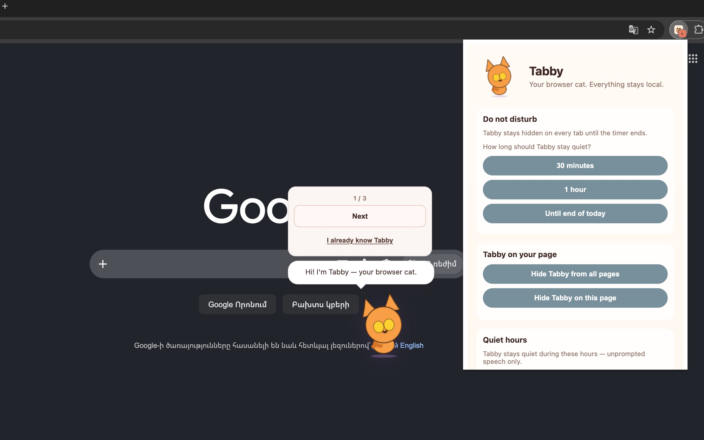
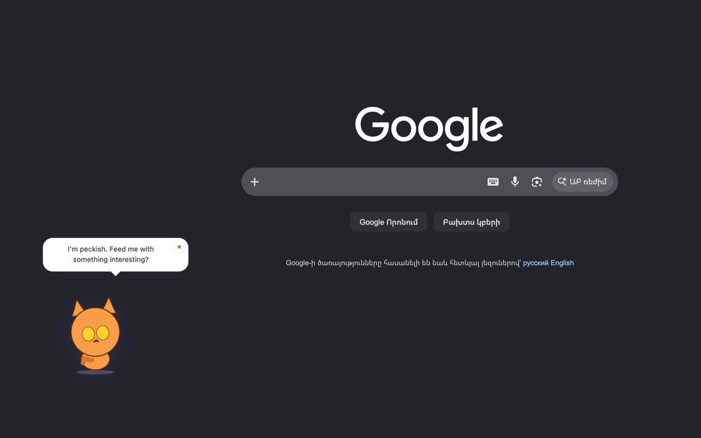
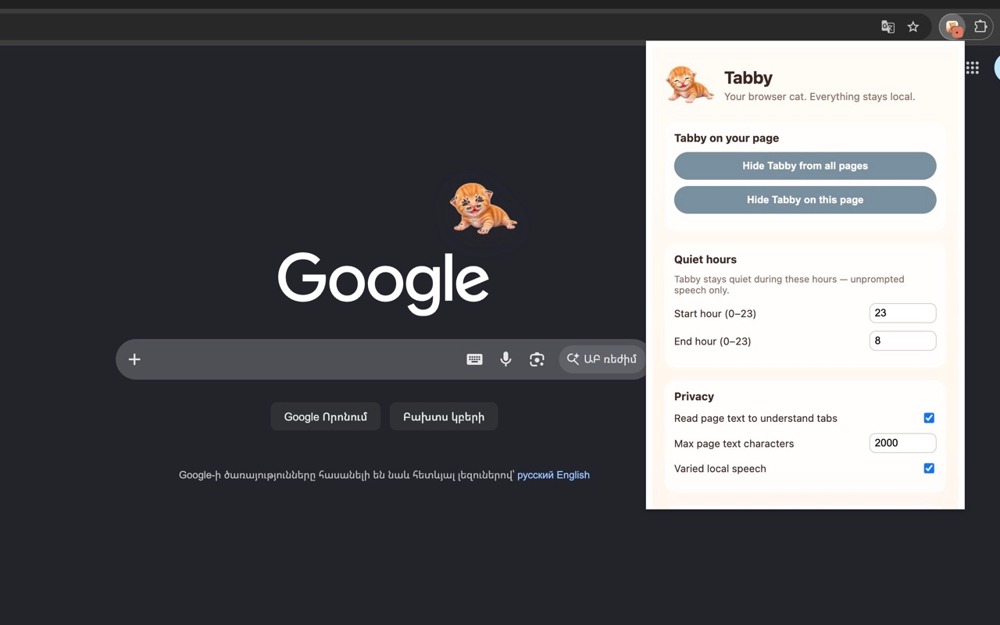

# How to use Tabby

A cat lives in your browser. She reacts to the pages you visit (tab title and web address only). Everything stays on your device.

## 1. Meet Tabby

Install Tabby and open any page. On first install she appears in the **bottom-left** with a short **three-step tour**: who she is, that she stays local, and how to feed or play with her.

Tap **Next** to walk through the steps, **Got it** on the last one, or **I already know Tabby** to skip. Skip keeps her **on screen** and quiet. She does not read page text.

## 2. Browse with Tabby

Drag her anywhere you like. She is a **Lottie-animated** cat with gold eyes and a purple collar.

Most of the time she stays out of the way. Now and then she may **peek in** from the edge, say a quiet line, or ask for food when she is hungry. Tap **×** on the bubble if you want to dismiss speech without opening the menu.

Her mood can shift gently after you **stay on a page for about a minute**. She never reads what is on the page, only the tab title and web address.

## 3. Tap Tabby to interact

Click the cat to open her **care menu**. Pick **Pet**, **Play**, **Feed Tabby**, or **What's up?** (the ask button changes with her mood). Her reply appears in a **speech bubble** beside the menu.

Tap **More** for **do not disturb** (30 minutes, 1 hour, or until end of today) or **Hide Tabby on this page**. Tap outside the menu or **×** to close it.

When she is **hungry**, feeding starts a short **munching moment**: the menu closes, she eats, then thanks you. **Play** can turn into a wild paw moment with jokes. During those moments the menu stays closed so you can watch.

**Pet** or **play** during a **peek** brings her out happy. Petting while she is hungry might earn a little sass.

## 4. Open settings

Click the **Tabby icon** in the toolbar.

**Do not disturb** hides her on **every tab** until the timer ends (30 minutes, 1 hour, or until end of today). You can cancel early from the same panel when it is active.

**Tabby on your page** lets you show or hide her on this tab or on all tabs. **Show Tabby on this page** brings her back even outside her quiet peek schedule.

**Quiet hours** keep **unprompted** speech off at night. **Privacy** explains that she uses tab title and web address only, with known sites and keywords.

**When Tabby speaks up** sets how often she may check in unprompted while you browse (not when you tap her).

---

**That's it.** Meet her once, browse, tap to care, open the toolbar for settings. No account. No cloud. All local.
