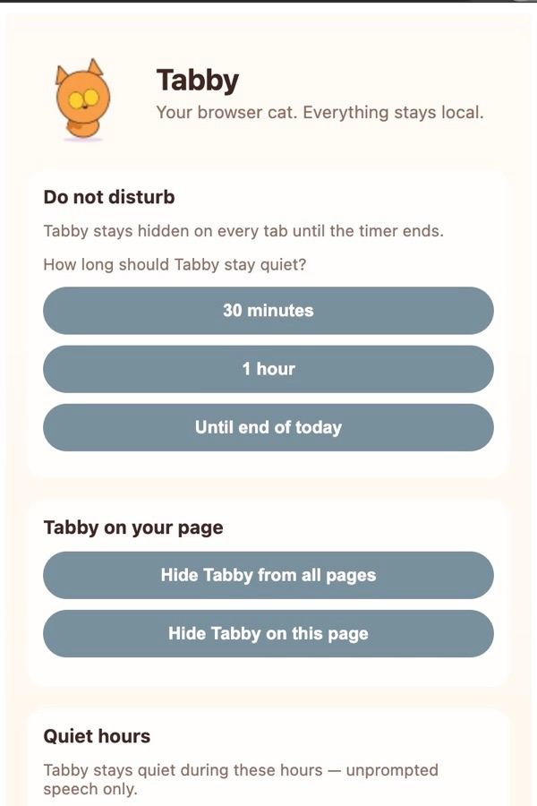
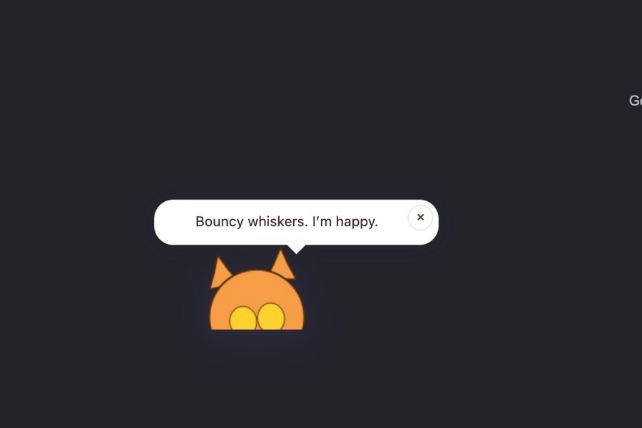
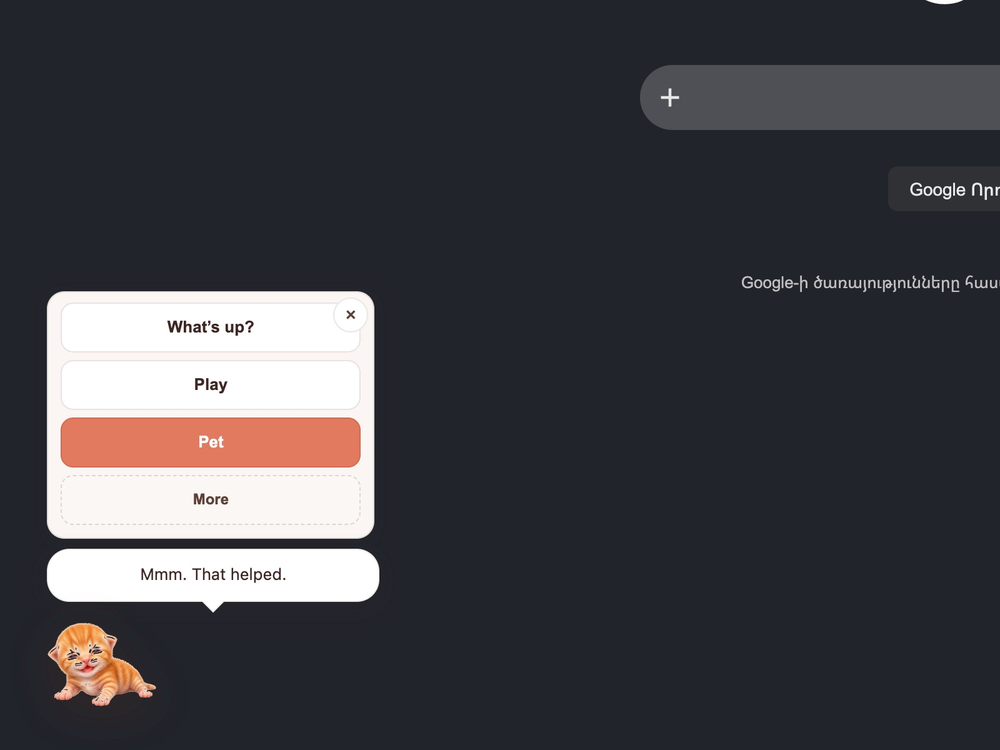
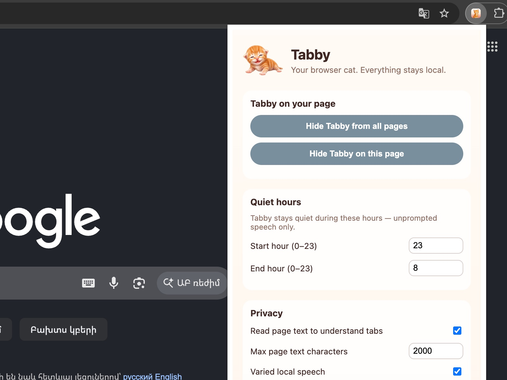
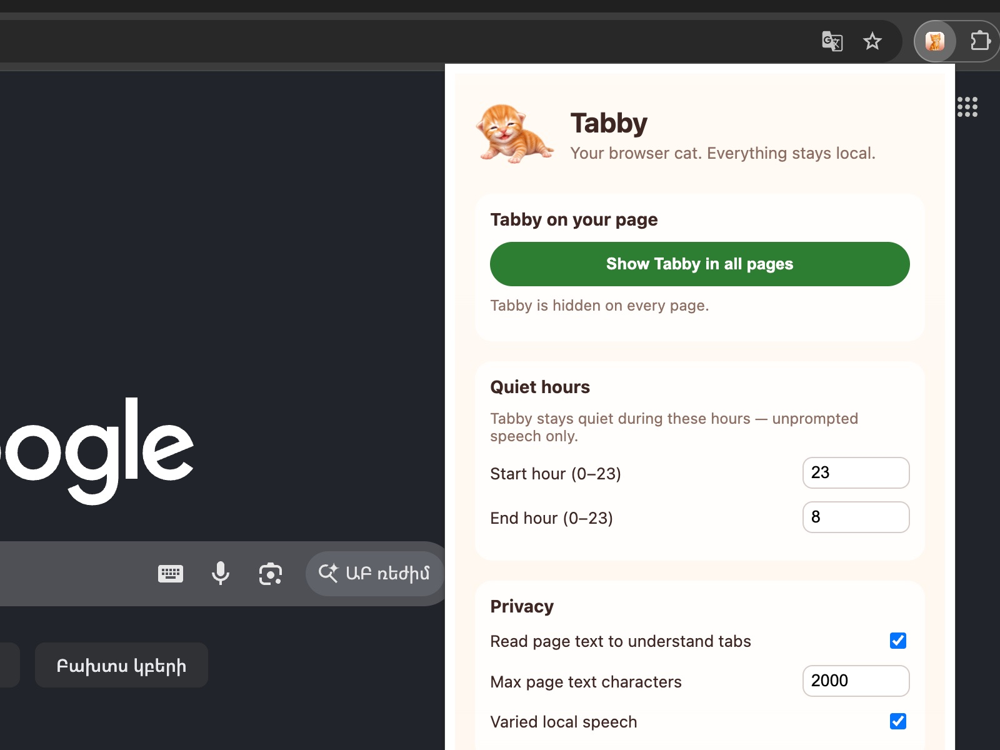

# How to use Tabby

A cat lives in your browser. She reacts to what you read. Everything stays on your device.

## 1. Browse with Tabby

Install Tabby and open any page. She appears in the corner while you browse.

Drag her anywhere you like. She may speak up now and then, or stay quiet if she is sleepy.

## 2. Tap Tabby to interact

Click the cat to open her menu. Pick an action — **Pet**, **Play**, **Feed**, or **What's up?**

She answers in a speech bubble. Tap outside the menu or press **×** to close it.

## 3. Open settings

Click the **Tabby icon** in the toolbar.

From here you can:

- **Show** or **hide** Tabby on this page or on every page
- Set **quiet hours** so she stays silent at night
- Turn **page text reading** and **local speech** on or off

---

**That's it.** Browse → tap Tabby → adjust settings. No account. No cloud. All local.
